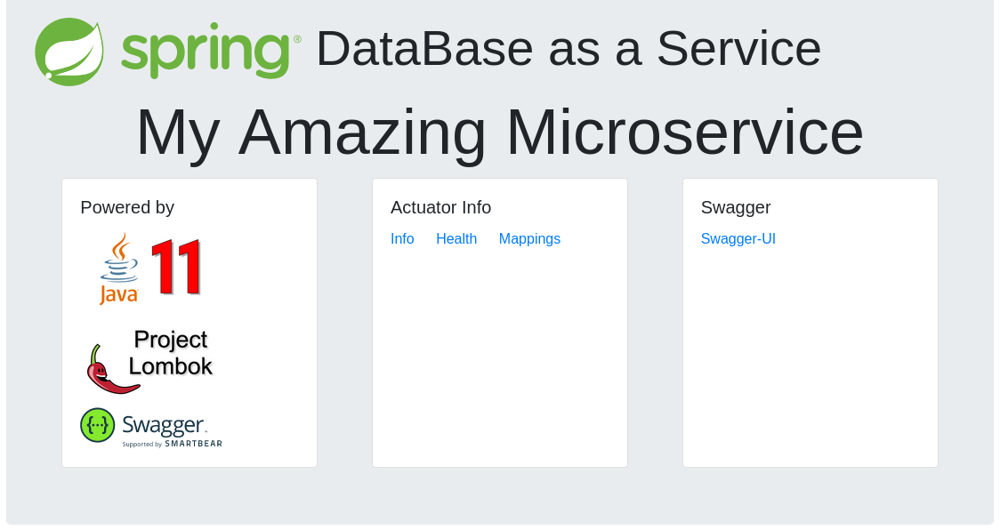
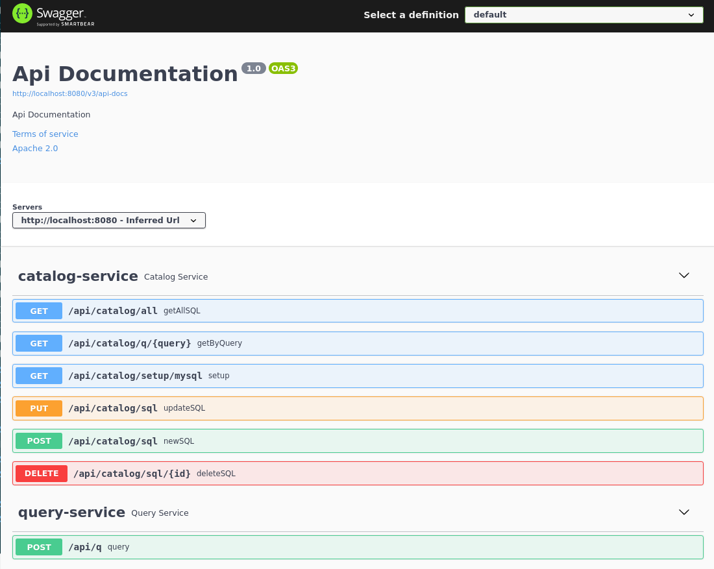
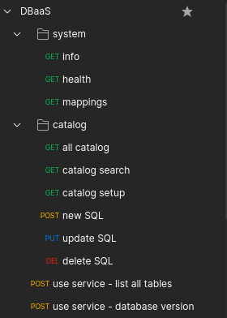

# DataBase as a Service

DataBase as a Service

## Why

This is an API REST based app ready for you to fork and code.
It is an easy and fast way to create queries as a service for databases, specially the legacy ones. 

## Features

* Java 11 based
* Spring Boot 2.5 based
* Swagger ready 
* Simple API
* Simple Unit test
* Simple Home Page
* ready to use
* Postman collection available

## Build and run 

```
$ mvn clean 
$ mvn spring-boot:run
```

Browse http://localhost:8080/

## Shots

### Homepage



### Swagger



### Postman



## Using

Using service:

```
$ curl -X POST localhost:8080/api/q -H 'Content-type:application/json' -d '{ "service": "s1","method":"m1","version": "v1" }'
 
[{"VERSION()":"10.6.4-MariaDB"}]

```

# How to code this project

## Architecture

* Database - MySQL 
* API - Spring Boot

## How it works

When the API is up, there is a table where the system stores dynamic SQLs, which can be called by REST service (all played internally by Spring JDBC Template).

## Suggested tools

* Database - DBeaver 
* API - Spring Tools Suite for Spring Boot

## Before coding

Please take a look at available issues, there are some job that need to be done. 

